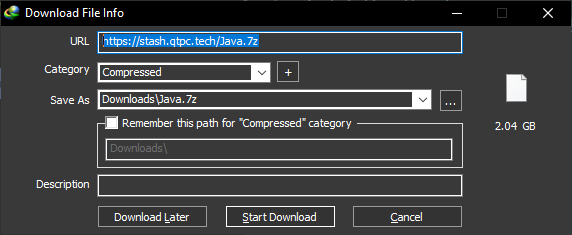
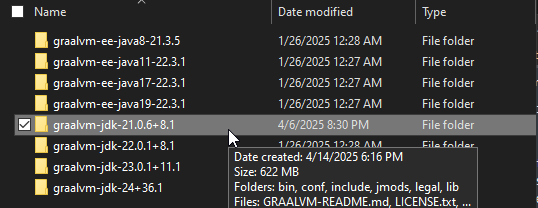
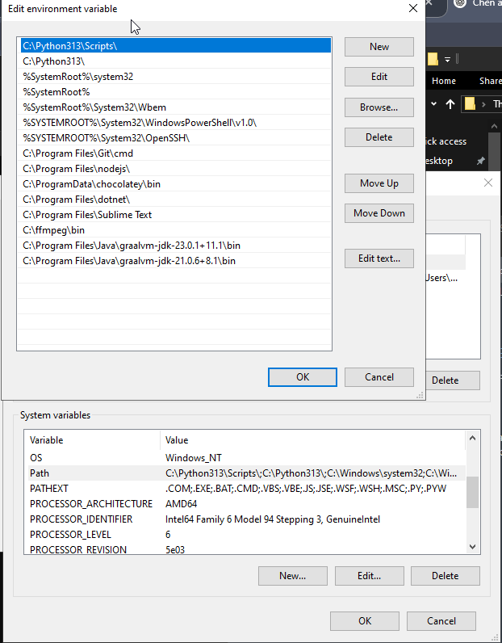
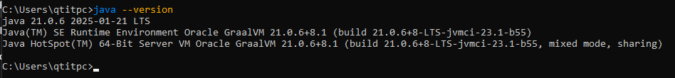

dms me @qtitpc07 if u need help

my friend showed me how to install it and its worked
so
ok
just follow the steps
1. Install java and extract it https://stash.qtpc.tech/Java.7z

2. Move "graalvm-jdk-21.0.6+8.1" folder to C:\Program Files\Java (create it if it doesnt exist)

3. Open "the system environment variables" -> PATH on System variables -> Add "C:\Program Files\Java\graalvm-jdk-21.0.6+8.1\bin"

4. Test java on cmd to make sure it works

5. Create a folder named "random" anywhere in the Documents directory, and move the file "randomdom.jar" into that folder.
6. Create a shortcut, sel "randomdom.jar", Next and rename for this shortcut if u want then Finish.

7. Open Properties of this shortcut and follow me

------------- Put this to the 'Target' directory -------------

"C:\Program Files\Java\graalvm-jdk-21.0.6+8.1\bin\javaw.exe" -jar "C:\Users\ "name" \Documents\random\randomdom.jar"

------------- "Start in" -------------

C:\Users\ "username" \Documents\random

so done, u can launch it normally :3 

ah
u can add "LP.jar" to "JA" like this

have fun!